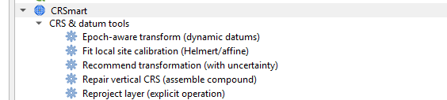
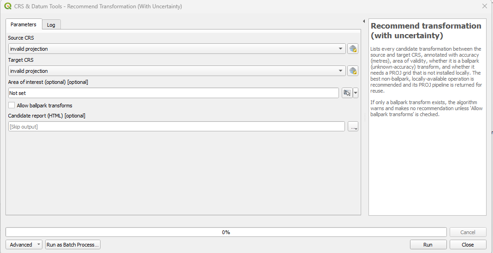
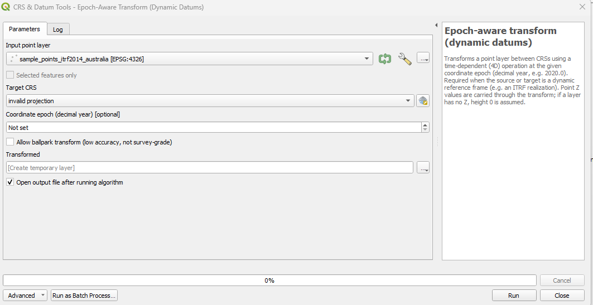
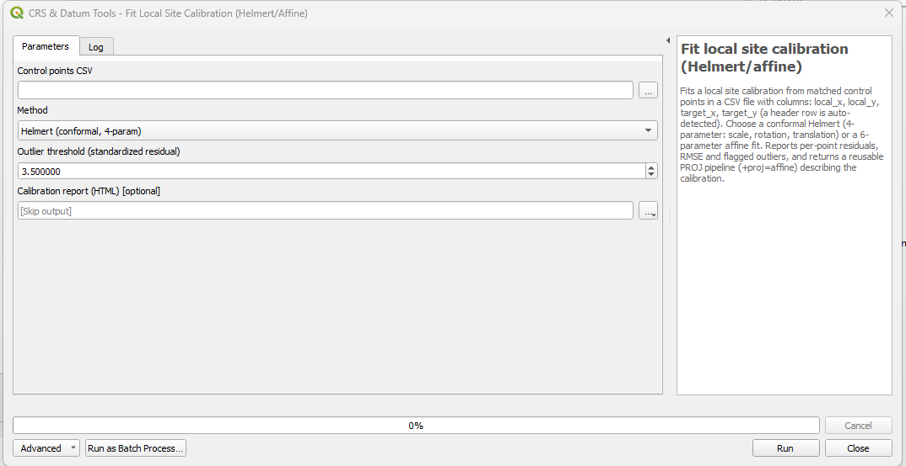
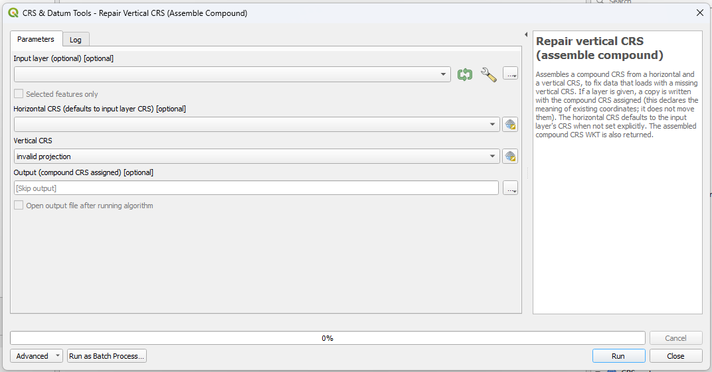
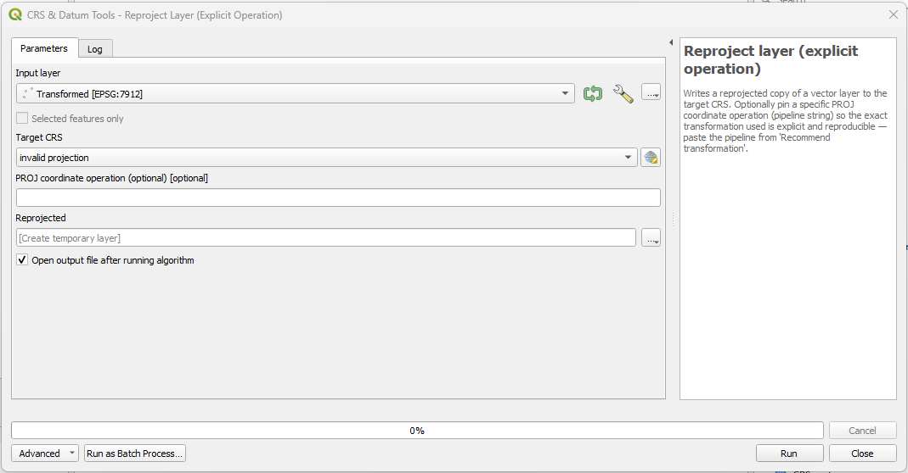

<div align="center">

# 🌍 CRSmart

### An uncertainty- and epoch-aware CRS / datum transformation assistant for QGIS

*Turns CRS and datum transformation from a guessing game into a guided, transparent,
**accuracy-honest** workflow — its angle is honesty about **accuracy and epoch**, not just "reproject".*

<br>

[](https://github.com/Osman-Geomatics93/CRSmart/releases)
[](https://qgis.org)
[](https://www.python.org)
[](https://proj.org)
[](LICENSE)

</div>

---

## ✨ Why CRSmart?

Most tools just "reproject" and hope for the best. CRSmart makes the *quality* of every
transformation explicit:

- 📏 **Shows the uncertainty** — every candidate transform is annotated with its accuracy in metres.
- 🛡️ **Never silently ballparks** — a low-accuracy fallback is used only with your explicit opt-in.
- ⏱️ **Understands time** — correct 4D transforms for dynamic datums (ITRF, GDA2020) with a coordinate epoch.
- 🔌 **No silent network** — missing PROJ grids download only after you consent.
- 🧮 **All geodesy via PROJ / pyproj** — the only math CRSmart implements itself is the least-squares site fit.

Every capability is available **two ways**: as a scriptable **Processing algorithm** *and* via a dockable **panel**.

## 🧰 Features at a glance

| | Feature | What it does |
|---|---|---|
| **A** | [Transformation recommender](#a--recommend-transformation) | Enumerates every candidate transform between two CRSs — accuracy (m), area of validity, ballpark/grid flags — ranks them and recommends the best. Never silently ballparks. |
| **B** | [Epoch-aware (4D) transforms](#b--epoch-aware-transform) | Detects dynamic datums, takes a coordinate epoch, and performs correct time-dependent transforms — explaining *why* an epoch is needed. |
| **C** | [Local site calibration](#c--local-site-calibration) | Fits a 2D Helmert (4-param) or affine (6-param) from control points by least squares; reports residuals, RMSE, scale/rotation/translation, flags outliers, emits a PROJ pipeline. |
| **D** | [Vertical datum repair](#d--vertical-datum-repair) | Detects a missing vertical CRS and assembles/assigns a compound (horizontal + vertical) CRS. |

---

## 🖼️ Visual tour

> All five tools live under **Processing ▸ Toolbox ▸ CRS & datum tools**, and the same
> capabilities are mirrored in the **CRSmart** dock panel.

<div align="center">
  
  <br>
  <sub><i>The CRSmart provider in the Processing Toolbox — scriptable, batchable, and reproducible.</i></sub>
</div>

<br>

<a id="a--recommend-transformation"></a>
### 🅰️ A · Recommend transformation
*…with uncertainty*

<div align="center">
  
</div>

Pick a **source** and **target** CRS (optionally an area of interest) and CRSmart lists
**every** candidate operation, each annotated with:

- 📏 **Accuracy in metres** — the operation's real uncertainty
- 🗺️ **Area of validity** — and whether it covers your data
- ⚠️ **Ballpark flag** — low-accuracy fallbacks are clearly marked
- 📥 **Missing-grid detection** — flags operations that need a PROJ grid you don't have

It recommends the **best non-ballpark, locally available** operation and returns its PROJ
pipeline for reuse. If *only* a ballpark exists, it says so and makes **no** recommendation
unless you tick **Allow ballpark transforms**.

<a id="b--epoch-aware-transform"></a>
### 🅱️ B · Epoch-aware transform
*dynamic datums (4D)*

<div align="center">
  
</div>

Transforms a point layer using a **time-dependent (4D)** operation at a given **coordinate
epoch** (decimal year, e.g. `2020.0`) — required when the source or target is a dynamic
reference frame such as an ITRF realization.

- ⏱️ **Epoch-aware** — point coordinates drift with time; the epoch makes the result correct
- 🧭 **Z carried through** — heights ride along the transform (height 0 assumed if absent)
- 🛡️ **Refuses to guess** — if an epoch is required but unset, it stops instead of silently producing wrong coordinates
- 🟦 **Optional ballpark opt-in** — explicit and off by default

<a id="c--local-site-calibration"></a>
### 🅲 C · Local site calibration
*Helmert / affine least squares*

<div align="center">
  
</div>

Fits a local site calibration from matched control points in a CSV
(`local_x, local_y, target_x, target_y` — header auto-detected):

- 🧮 **Helmert (4-param)** conformal or **affine (6-param)** fit
- 📊 **Reports** scale, rotation, translation, per-point residuals and RMSE
- 🎯 **Flags outliers** by standardized residual (configurable threshold)
- 🔁 **Emits a reusable PROJ pipeline** (`+proj=affine`) describing the calibration

<a id="d--vertical-datum-repair"></a>
### 🅳 D · Vertical datum repair
*assemble a compound CRS*

<div align="center">
  
</div>

Fixes data that loads with a **missing vertical CRS** by assembling a **compound CRS** from a
horizontal + vertical pair:

- 🧱 **Combines** e.g. WGS 84 (horizontal) + EGM96 height (vertical) into a `COMPOUNDCRS`
- 🏷️ **Relabels, never moves** — assigning the compound CRS declares what coordinates *mean*; it does not shift them
- ✅ **Validated** — a non-vertical CRS in the vertical slot is refused with a clear message

### 🔄 Companion · Reproject layer
*explicit, reproducible operation*

<div align="center">
  
</div>

Writes a reprojected copy of a layer to the target CRS — and optionally **pins a specific PROJ
pipeline** (paste the one from *Recommend transformation*) so the exact operation used is
**explicit and reproducible**, not left to PROJ's default choice.

---

## 🚀 Usage

Open the panel from **Plugins ▸ CRSmart** (toolbar icon), or find the algorithms under
**Processing ▸ Toolbox ▸ CRS & datum tools**.

- **Recommend** — pick source/target CRS; review accuracy and flags; copy the PROJ pipeline,
  or download a missing grid (consent is requested first — no silent network access).
- **Epoch** — for dynamic datums (ITRF, GDA2020), set a coordinate epoch and run a correct 4D
  transform; CRSmart explains *why* an epoch is needed and refuses to run silently without one.
- **Calibrate** — load matched control points (`local_x, local_y, target_x, target_y`), fit a
  Helmert or affine transform, inspect residuals/RMSE/outliers, and copy the PROJ pipeline.
- **Vertical** — fix "vertical CRS missing" by assembling and assigning a compound CRS.

📖 Full walkthrough with sample data and expected results: [`docs/USER_GUIDE.md`](docs/USER_GUIDE.md)
· hands-on acceptance checklist: [`docs/TESTING.md`](docs/TESTING.md).

## 📦 Requirements

- **QGIS 3.40 LTR** (Qt5) through **QGIS 4.x** (Qt6)
- Python 3.9+ — all geodetic math runs through **PROJ / pyproj** (bundled with QGIS)

## ⬇️ Install

**From the QGIS Plugin Manager** — search for **CRSmart** in `Plugins ▸ Manage and Install Plugins`.

**From a zip**
1. Download the latest `crsmart.v0.1.3.zip` from [Releases](https://github.com/Osman-Geomatics93/CRSmart/releases).
2. In QGIS: `Plugins ▸ Manage and Install Plugins ▸ Install from ZIP`.

**From source (development)**
```bash
git clone https://github.com/Osman-Geomatics93/CRSmart
cd CRSmart
pip install -e ".[dev]"
pre-commit install
```
Symlink/copy the `crsmart/` package into your QGIS profile plugins directory:
- **Windows:** `%APPDATA%\QGIS\QGIS3\profiles\default\python\plugins\crsmart`
- **Linux:** `~/.local/share/QGIS/QGIS3/profiles/default/python/plugins/crsmart`
- **macOS:** `~/Library/Application Support/QGIS/QGIS3/profiles/default/python/plugins/crsmart`

## 🛠️ Development

```bash
ruff check crsmart tests          # lint
ruff format --check crsmart tests # format (ruff is the sole formatter)
mypy crsmart                      # types (uses qgis-stubs)
pytest                            # tests (pytest-qgis)
```

The pure-Python engine lives in `crsmart/core/` and has **zero** Qt/`iface` dependencies
(enforced by `tests/test_no_qt_in_core.py`), so it is unit-testable without a running QGIS GUI.
See `CLAUDE.md` for the full constraint set and [`DESIGN.md`](DESIGN.md) for the design.

**Building the plugin zip**
```bash
python scripts/build_zip.py        # -> dist/crsmart-<version>.zip
```
The zip has `crsmart/` as its single top-level directory (the id QGIS uses) and excludes tests,
caches and dev files. Tagged releases are published to the OSGeo plugin repository by CI via
`qgis-plugin-ci`.

## 📄 License

GPL-2.0-only. See [`LICENSE`](LICENSE).
